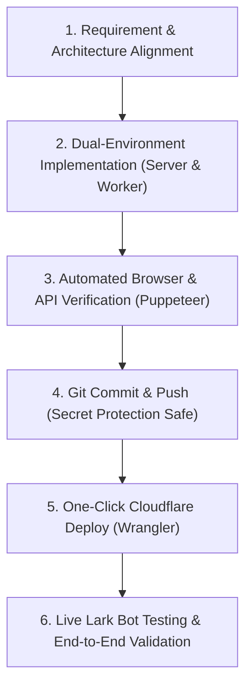

# 📚 IT Asset Hub: Architecture, Lark API Tricks & Handover Guide

คู่มือสรุปสถาปัตยกรรมระบบ, ทริคสำคัญ (Gotchas), คีย์คอนฟิก และแนวทางปฏิบัติสำหรับการส่งต่องานและการพัฒนาต่ออย่างราบรื่น

---

## 🌐 1. ข้อมูลระบบและการ Deploy (Production & Development)

| รายการ | ค่าที่ใช้งาน (Configuration) |
| :--- | :--- |
| **GitHub Repository** | `Sukky334576/it-asset-portal` (Branch: `main`) |
| **Cloudflare Production URL** | `https://it-asset-portal.shine-toothbrush.workers.dev` |
| **Cloudflare Account ID** | `e2d00bf217d08093261362e69871d081` (Shine Toothbrush) |
| **Local Dev Server** | `http://localhost:3000` (รันด้วย `node server.js` หรือ `npx wrangler dev`) |
| **Node.js Runtime** | Node.js 18+ (พร้อม `express`, `cors`, `helmet`, `crypto`) |

---

## 🔑 2. Lark Credentials, Tokens & Base Table IDs

> **คำเตือนความปลอดภัย**: ข้อมูลชุดนี้ใช้สำหรับระบบภายในองค์กร XPO & EDDU เท่านั้น

```ini
LARK_APP_ID = "cli_aa9a88a6e7f89ed2"
LARK_APP_SECRET = "qmzk... (See .env or wrangler.toml)"
BASE_TOKEN = "G2IgbTgmmaLnQPs3LPblGz0ngQf"
LARK_BOT_SECRET = "it_asset_hub_secure_hmac_secret_2026"
ADMIN_PASSWORD = "itadmin2026"
LIFECYCLE_PASSWORD = "lifecycle2026"
```

### 📊 Lark Base Table IDs:
1. **IT Assets Master (ตารางทรัพย์สินหลัก)**: `tblA1JXS2dWC9a5b`
2. **Audit Logs & Discrepancies (ตารางประวัติการยืนยัน/แจ้งซ้ำ)**: `tblzKjtJuoAifQKS`
3. **Temporary Loans & Returns (ตารางยืม-คืนอุปกรณ์ชั่วคราว)**: `tblwL0cJzvv1qsj3`

---

## 🛡️ 3. สถาปัตยกรรมความปลอดภัย & Lark SSO 2.0 (Core Architecture)

### 3.1 Strict Lark SSO Gateway (Zero Data Leakage)
- **เมื่อยังไม่ล็อกอิน**: หน้าเว็บจะไม่แสดงรายชื่อพนักงาน, ช่องค้นหา หรือตารางเครื่องใดๆ ทั้งสิ้น โดยจะแสดงเฉพาะหน้า **Lark SSO Gateway (1-Click Login)**
- **เมื่อล็อกอินผ่าน Lark สำเร็จ**: ระบบจะใช้ **Lark OpenID (`ou_...`)** ในการดึงเฉพาะเครื่องที่เป็นของพนักงานคนนั้น 100% 
- **ปิดช่องค้นหาชื่อถาวร**: พนักงานไม่สามารถพิมพ์ค้นหาหรือดูเครื่องของเพื่อนร่วมงานคนอื่นได้ ป้องกันปัญหาข้อมูลสับสน (Data Collision) โดยสิ้นเชิง

### 3.2 Registered Redirect URLs ใน Lark Developer Console:
ต้องมี URL เหล่านี้อยู่ใน **Security Settings ➔ Redirect URLs** เสมอ:
- `http://localhost:3000/auth/callback`
- `https://it-asset-portal.shine-toothbrush.workers.dev/`
- `https://it-asset-portal.shine-toothbrush.workers.dev/auth/callback`

---

## 💡 4. ทริคสำคัญ & Gotchas ที่ต้องรู้ (Crucial Tricks & Pitfalls)

### 🔴 Trick 1: ปัญหา Lark Error 20029 (Invalid redirect URL)
- **สาเหตุ**: Lark OAuth ตรวจสอบ URL ละเอียดมาก หากโปรโตคอลเป็น `http://` แทนที่จะเป็น `https://` บน Cloudflare Worker / Tunnel จะถูกปฏิเสธทันที
- **วิธีแก้**: ใน `server.js` และ `worker.js` ต้องตั้งค่า `app.set('trust proxy', 1)` และบังคับโปรโตคอลให้เป็น `https://` เสมอเมื่ออยู่บน Cloudflare หรือ Reverse Proxy

### 🔴 Trick 2: การบันทึก User Field ใน Lark Base API (Error 1254066 `UserFieldConvFail`)
- **สาเหตุ**: ฟิลด์ `Current Holder (ผู้ถือครองปัจจุบัน)` ใน Lark Base เป็นประเภท **User Field** ซึ่ง API ของ Lark รองรับเฉพาะการส่ง Array ของ Object ที่มี `id` เป็น Lark OpenID (`[{ "id": "ou_..." }]`)
- **ข้อห้าม**: ห้ามส่ง `[{ "name": "Somchai" }]` เข้า User Field เด็ดขาด เพราะจะเกิด Error `UserFieldConvFail`
- **วิธีปฏิบัติ**: หากไม่มี `ou_...` ให้ใส่ชื่อผู้ถือครองลงในฟิลด์ข้อความ `Specs / Notes` แทน

### 🔴 Trick 3: บอทส่งการ์ดไม่ไป (Error 230013 `Bot has NO availability to this user`)
- **สาเหตุ**: Lark Developer Console ยังไม่ได้เปิดสิทธิ์ขอบเขตความพร้อมใช้งาน (Availability) ให้เป็น All Members
- **วิธีแก้**: ไปที่ **Lark Developer Console** ➔ **Version Management & Release** ➔ **Availability** ➔ เลือก **All Members (พนักงานทุกคน)** ➔ กด **Create a Version** ➔ กด **Publish**

### 🔴 Trick 4: ป้องกันปัญหาการจับคู่ชื่อซ้ำ (Substring Collision)
- **ปัญหาเดิม**: การใช้ `String.includes()` จะทำให้คนชื่อ `Phat` ไปจับคู่กับ `Tle.Teeraphat`
- **วิธีแก้ที่ทำแล้ว**: ใช้ **Lark OpenID (`ou_...`)** เป็น Primary Match Key เสมอ และหากเปรียบเทียบชื่อ ให้ใช้ `===` (Exact Match) แบบ Case-Insensitive เท่านั้น

### 🔴 Trick 5: โครงสร้างเวลาแคมเปญ Freeze Period
- แคมเปญถูกกำหนดไว้คือ: **วันศุกร์ที่ 28 ส.ค. 2026 09:00 น. ถึง วันศุกร์ที่ 4 ก.ย. 2026 18:00 น.**
- ด้านบนสุดของเว็บมี Countdown Timer คำนวณแบบ Dynamic 3 ช่วง (ก่อนเริ่ม, กำลังรัน, สิ้นสุดแคมเปญ)

---

## ⚡ 5. Quick Command Reference (คำสั่งลัด)

### Deploy ขึ้น Cloudflare Workers:
```bash
cd "/Users/xpo/Downloads/CSM Part/it-asset-portal"
npx wrangler deploy
```

### สั่งรัน Server Localhost บนเครื่อง Mac:
```bash
cd "/Users/xpo/Downloads/CSM Part/it-asset-portal"
node server.js
```

### ทดสอบยิง Lark Card หาพนักงานเฉพาะบุคคล:
```bash
node -e '
(async () => {
  const LarkDirectApi = require("./services/larkDirectApi");
  const larkBot = require("./services/larkBot");
  const lark = new LarkDirectApi("cli_aa9a88a6e7f89ed2", "qmzk77vbQMpFtUP66JRr1ebJPyqHooD5", "G2IgbTgmmaLnQPs3LPblGz0ngQf");
  const openId = "ou_ddbd83ad4f843334774fcde57c094c32"; // ระบุ OpenID ปลายทาง
  const name = "Aof.Thanakorn";
  const records = await lark.fetchRecords("tblA1JXS2dWC9a5b");
  const myDevices = records.filter(r => JSON.stringify(r).includes(openId));
  const cardPayload = larkBot.createVerificationCard(name, myDevices, openId);
  const token = await lark.getTenantAccessToken();
  const res = await fetch("https://open.larksuite.com/open-apis/im/v1/messages?receive_id_type=open_id", {
    method: "POST",
    headers: { "Authorization": `Bearer ${token}`, "Content-Type": "application/json" },
    body: JSON.stringify({ receive_id: openId, msg_type: "interactive", content: JSON.stringify(cardPayload) })
  });
  console.log(await res.json());
})();'
```

---

## 🤝 6. Collaboration Workflow (แนวทางและกระบวนการทำงานร่วมกันระหว่าง User & AI Agent)

เพื่อให้การทำงานร่วมกันมีประสิทธิภาพสูงสุดและต่อเนื่อง ไม่ว่าจะเปิด Conversation ใหม่กี่ครั้ง ให้ยึดแนวทางปฏิบัติดังนี้:

### 6.1 บทบาทหน้าที่ (Roles & Responsibilities):
- **User (Product Owner & Lark Admin)**:
  - กำหนด Business Logic, เงื่อนไขแคมเปญ และ Requirement การใช้งานจริง
  - อนุมัติสิทธิ์ (Allow) บน Cloudflare Dashboard หรือจัดการ Scope / Redirect URLs ใน Lark Developer Console
  - ทดสอบ User Flow บนอุปกรณ์จริงร่วมกับทีมงาน
- **AI Agent (Full-Stack Engineer & DevOps)**:
  - ออกแบบสถาปัตยกรรมและเขียนโค้ดทั้งระบบ (Frontend UI, Express Server, Cloudflare Worker, Lark REST API)
  - จัดการ Git Version Control, ตรวจสอบ Secret Scanning ก่อน Push
  - จัดการ Build & Deploy ขึ้น Cloudflare Workers ผ่าน `wrangler`
  - ตรวจสอบความถูกต้องด้วย Unit Test, Curl และจับภาพหน้าจอด้วย Puppeteer เพื่อ Verify ก่อนส่งมอบ

---

### 6.2 ขั้นตอนการพัฒนาและส่งมอบงานมาตรฐาน (6-Step Development Lifecycle):



1. **Step 1: Alignment**: รับโจทย์ วิเคราะห์ผลกระทบต่อ Lark Base Schema และโครงสร้างข้อมูล
2. **Step 2: Dual Implementation**: เขียนโค้ดให้รองรับ 2 สภาพแวดล้อมพร้อมกันเสมอ:
   - `server.js`: Node.js Express สำหรับ Local Development
   - `worker.js`: Cloudflare Serverless สำหรับ Production
3. **Step 3: Verification**: ใช้ Puppeteer จำลองหน้าจอและแคปเจอร์ภาพ Screenshot ตรวจสอบ UI ทุกครั้ง
4. **Step 4: Safe Git Push**: จัดการ Git Commit และระวังการ Mask คีย์ Secret เสมอ เพื่อไม่ให้ติด GitHub Push Protection
5. **Step 5: Production Deployment**: รัน `npx wrangler deploy` เพื่ออัปเดตระบบจริงไปยัง `shine-toothbrush.workers.dev`
6. **Step 6: Live Bot & SSO Testing**: ทดสอบยิง Lark Card และตรวจสอบ OAuth SSO จริงกับบัญชีพนักงานเป้าหมาย

---

### 6.3 กฎการสื่อสารและการทำงานที่มีประสิทธิภาพ (Communication Best Practices):
- **กระชับ ชัดเจน และมีหลักฐาน**: รายงานผลด้วยภาพ Screenshot และผลลัพธ์ JSON จริงเสมอ
- **Step-by-Step Action สำหรับ User**: หากต้องมีการตั้งค่าบนหน้าเว็บ Lark/Cloudflare ให้สรุปเป็นข้อๆ สั้นๆ พร้อมระบุเมนูและปุ่มที่ต้องกดให้ชัดเจน
- **Auto-Sync to Markdown**: เมื่อมีการเปลี่ยนคอนฟิก หรือเจอปัญหาใหม่ (Gotcha) ให้บันทึกอัปเดตลงในไฟล์นี้ทันที

---

*เอกสารฉบับนี้ถูกสร้างขึ้นเพื่อใช้เป็น Single Source of Truth สำหรับโปรเจกต์ IT Asset Management Hub.*
